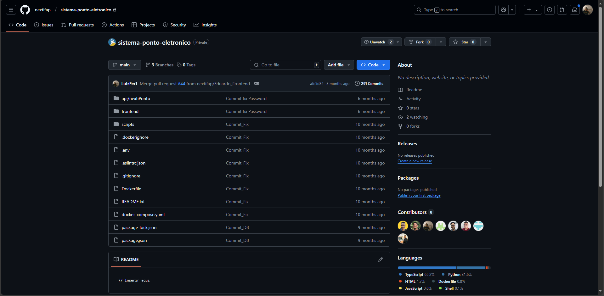
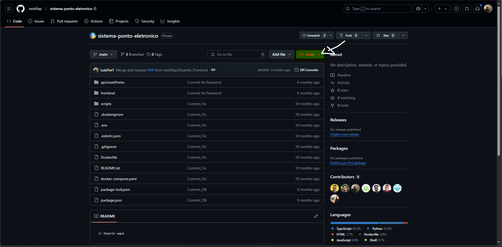
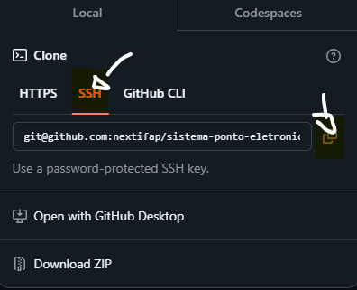

Clonar um repositório é uma tarefa simples, mas requer alguns passos para garantir que tudo esteja configurado corretamente. Aqui está um guia passo a passo.

### **1. Conseguindo o Link do Repositório**

Antes de tudo, você precisa obter o link do repositório que deseja clonar.

- **Passo 1:** Acesse a página do repositório no GitHub (ou outra plataforma de hospedagem de código).

- **Passo 2:** Na página do repositório, clique no botão **"Code"**.

- **Passo 3:** Copie o link SSH ou HTTPS fornecido. Para usar SSH (o recomendado para autenticação segura), o link geralmente se parecerá com este: 

- `git@github.com:SEU-USERNAME/SEU-PROJETO.git`.

Se você ainda não configurou sua chave SSH, veja a seção abaixo.

### **2. Preparando o Ambiente para Clonar**

#### **Configurando a chave SSH (caso ainda não tenha feito)**

Se você ainda não configurou uma chave SSH para autenticação com o GitHub, siga este processo:

1. Abra o **Git Bash** (ou terminal de sua preferência).
    
2. Verifique se já existe uma chave SSH configurada no bash digite:
    
    `ls -al ~/.ssh`
    
    Se você não vir arquivos como `id_rsa.pub`, é necessário criar uma nova chave SSH.
    
3. Para criar uma nova chave SSH, execute o comando:
    
    `ssh-keygen -t rsa -b 4096 -C "seu-email@dominio.com"`
    
    Siga as instruções para salvar o arquivo e adicione sua chave SSH ao agente SSH:
    
    `eval "$(ssh-agent -s)" ssh-add ~/.ssh/id_rsa`
    
4. Copie a chave SSH gerada para o seu GitHub:
    
    - No terminal, use o comando abaixo para copiar a chave pública para a área de transferência:
        
        `cat ~/.ssh/id_rsa.pub`
        
    - Acesse [GitHub > Settings > SSH and GPG keys](https://github.com/settings/keys), clique em **"New SSH key"**, cole a chave copiada e salve.
        

Agora sua chave SSH está configurada, e você poderá usar o Git para clonar projetos de maneira segura.

---

### **3. Clonando o Repositório**

Agora, vamos clonar o repositório para a sua máquina local.

1. Abra o **Git Bash** (ou terminal).
    
2. Navegue até o diretório onde você deseja salvar o projeto, usando o comando `cd` (exemplo: `cd ~/Projetos`).
    
3. Digite o seguinte comando para clonar o repositório:
    
    `git clone git@github.com:SEU-USERNAME/SEU-PROJETO.git`
    
    Substitua `SEU-USERNAME` pelo seu nome de usuário e `SEU-PROJETO` pelo nome do repositório.
    
4. O Git irá solicitar autenticação (caso seja necessário). Se você configurou corretamente a chave SSH, o processo será concluído automaticamente e o repositório será clonado para uma pasta com o nome do repositório dentro do diretório escolhido.
    

### **4. Confirmando o Clonagem**

Após o comando ser executado com sucesso, entre no diretório do projeto:

`cd SEU-PROJETO`

E verifique o status do repositório com:

`git status`

Isso deve mostrar que você está na branch principal (geralmente `main` ou `master`).

---

### **Dicas Importantes**

- **SSH vs HTTPS:** Usar SSH é mais seguro e evita a necessidade de inserir sua senha a cada vez que fizer push ou pull.
    
- **Atualizações:** Se desejar obter atualizações futuras do repositório, use:
    
    `git pull`
    
- **Alterações Locais:** Caso você faça alterações e queira enviar suas mudanças de volta ao repositório, use:
    
    `git add . git commit -m "Descrição das mudanças" git push origin main`
    

Agora, você tem seu projeto clonado e pode começar a trabalhar nele!